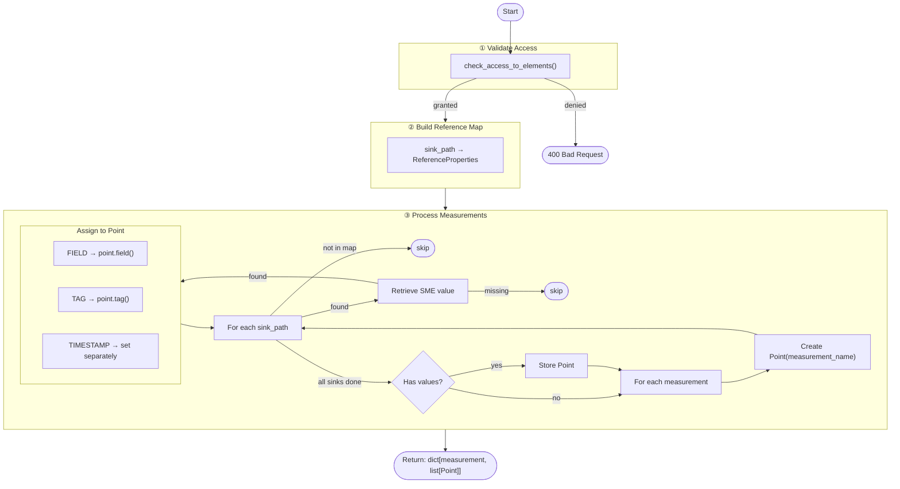

# Mapping Process: From SubmodelElements to Influx Objects

## Overview

The mapping process transforms SubmodelElement (SME) values from the Asset Administration Shell (AAS) into InfluxDB Point objects based on the database mapping configuration. This document describes the complete workflow and architecture.

## Process Flow



## Class Architecture

### InfluxMapper Class

```
InfluxMapper
├── __init__(server_handler, db_mapping, target_references)
│
├── map_smes_to_influx() → dict[str, list[Point]]
│   ├── _validate_element_access() → None
│   │
│   ├── _build_reference_map() → dict[str, ReferenceProperties]
│   │
│   └── _process_measurement(measurement_name, mapping, ref_map) → Point | None
│       ├── _add_value_to_point(point, sink_path, type, ref_map) → bool
│       │   ├── _retrieve_sme_value(reference) → Any | None
│       │   │   └── [Get submodel → Get SME → Extract value]
│       │   │
│       │   └── _assign_value_to_point(point, sink_path, value, type) → None
│       │       └── [Add as field, tag, or timestamp]
│       │
│       └── [Continue for all sinks in measurement]
```

## Detailed Steps

### 1. Validation Phase

**Method**: `_validate_element_access()`

- Calls `check_access_to_elements()` with all target references
- Verifies that every mapped SME is accessible via the AAS server
- Raises `HTTPException(400)` if any element is inaccessible
- Logged warnings identify which elements are unreachable

### 2. Reference Mapping Phase

**Method**: `_build_reference_map()`

- Creates a lookup dictionary for fast O(1) access
- Maps sink path strings to their `ReferenceProperties` objects
- Sink paths are concatenated from `parent_path + [property_name]`
- Example: `"EnergyConnection_Electric.EnergyMeasure_EnergyTotal.value"`

### 3. Measurement Processing Phase

**Method**: `_process_measurement()`

For each measurement in the DB mapping configuration:

1. Create a new InfluxDB `Point` object with the measurement name
2. Iterate through all sink paths defined for this measurement
3. For each sink path:
   - Check if it exists in the reference map
   - Attempt to add its value to the Point
   - Track whether any values were successfully added
4. Return the Point only if it contains at least one value

### 4. Value Retrieval Phase

**Method**: `_retrieve_sme_value(reference)`

For a given SubmodelElement reference:

1. Fetch the Submodel from the AAS via registry using `reference.submodel_id`
2. Locate the SubmodelElement within the Submodel using the full element path
3. Verify the element exists and has a `value` attribute
4. Extract and return the element's value
5. Return `None` if element is missing or has no value attribute

**Error Handling**:
- Logs warnings for missing elements or missing value attributes
- Returns `None` instead of raising exceptions
- Caller decides whether to skip or fail

### 5. Value Assignment Phase

**Method**: `_assign_value_to_point()`

Based on the target type from the mapping configuration:

| Target Type | Action | Example |
|-------------|--------|---------|
| `FIELD` | `point.field(sink_path, value)` | Numeric/string data |
| `TAG` | `point.tag(sink_path, str(value))` | Indexed metadata |
| `TIMESTAMP` | Log debug message | Handled separately |

## Configuration Structure

### DB Mapping Format

```python
DbMapping = {
    "measurement_name": {
        "sink.path.to.element": "field" | "tag" | "timestamp",
        "another.sink.path": "tag",
        ...
    },
    "another_measurement": {
        ...
    }
}
```

### Example Configuration

```json
{
    "EnergyMetrics": {
        "EnergyConnection_Electric.EnergyMeasure_Total.value": "field",
        "EnergyConnection_Electric.EnergyMeasure_Total.timestamp": "timestamp",
        "machineStateData.machineState": "tag"
    },
    "PressureMetrics": {
        "EnergyConnection_Pneumatic.Pressure.value": "field",
        "EnergyConnection_Pneumatic.Pressure.timestamp": "timestamp"
    }
}
```

## Data Flow Example

### Input
```python
# Database Mapping Configuration
{
    "temperature_data": {
        "TemperatureSensor.Value.current": "field",
        "TemperatureSensor.Value.timestamp": "timestamp",
        "TemperatureSensor.Metadata.location": "tag"
    }
}

# Target References (from AIMC)
[
    ReferenceProperties(
        submodel_id="urn:sensor:submodel",
        parent_path=["TemperatureSensor", "Value"],
        property_name="current"
    ),
    ReferenceProperties(
        submodel_id="urn:sensor:submodel",
        parent_path=["TemperatureSensor", "Metadata"],
        property_name="location"
    )
]
```

### Processing Steps

1. **Validate Access**: Check that both SMEs are accessible ✓
2. **Build Reference Map**:
   ```python
   {
       "TemperatureSensor.Value.current": ReferenceProperties(...),
       "TemperatureSensor.Metadata.location": ReferenceProperties(...)
   }
   ```
3. **Process measurement "temperature_data"**:
   - Create `Point("temperature_data")`
   - Add "TemperatureSensor.Value.current" as FIELD → `point.field(..., 23.5)`
   - Add "TemperatureSensor.Value.timestamp" → Not in mapping, skip
   - Add "TemperatureSensor.Metadata.location" as TAG → `point.tag(..., "Lab-A")`
4. **Return**:
   ```python
   {
       "temperature_data": [Point object with 1 field + 1 tag]
   }
   ```

### Output
```python
Point("temperature_data")
  .field("TemperatureSensor.Value.current", 23.5)
  .tag("TemperatureSensor.Metadata.location", "Lab-A")
```

## Error Handling

### Access Validation Failures
- **Condition**: Element not accessible via AAS server
- **Action**: Raise `HTTPException(400, "Some mapped elements are not accessible")`
- **Prevention**: All elements must be in target_references list

### Retrieval Failures
- **Condition**: SubmodelElement not found or missing value attribute
- **Action**: Log warning and skip element
- **Impact**: Measurement Point created without that specific value

### Assignment Failures
- **Condition**: Exception during value assignment
- **Action**: Log error and skip sink path
- **Impact**: Point created with remaining values

## Integration Points

### Upstream Dependencies

- **ServerHandler**: Manages AAS registry and repository connections
- **DbMapping**: Database mapping configuration from config service
- **ReferenceProperties**: Target SME locations from AIMC extraction
- **check_access_to_elements()**: Access validation utility

### Downstream Usage

```python
# In PollingWorker._poll_once()
mapper = InfluxMapper(
    server_handler=server_handler,
    db_mapping=db_mapping_config,
    target_references=app.state.target_references
)

influx_points = mapper.map_smes_to_influx()

# Write points to InfluxDB
for measurement_name, points in influx_points.items():
    for point in points:
        influx_client.write_api.write(record=point, bucket=bucket_name)
```

## Performance Considerations

- **Reference Map**: O(1) lookup for sink paths
- **Measurement Processing**: O(M × S) where M = measurements, S = sinks per measurement
- **Value Retrieval**: O(1) per sink (caching could optimize repeated accesses)
- **Memory**: One Point object per measurement with values

## Constraints & Limitations

1. **Single Timestamp per Measurement**: Only one sink path can be marked as `timestamp`
2. **Element Accessibility**: All mapped elements must be accessible at mapping time
3. **Value Attributes**: Only elements with `.value` attribute are supported
4. **Type Conversion**: Tags are auto-converted to strings; fields preserve original types
5. **No Circular References**: Mapping assumes DAG structure in AIMC

## Future Enhancements

- [ ] Support for collection-type elements (arrays, ranges)
- [ ] Configurable timestamp handling (extraction vs. injection)
- [ ] Caching of frequently accessed submodels
- [ ] Batch element access optimization
- [ ] Support for computed/derived values
