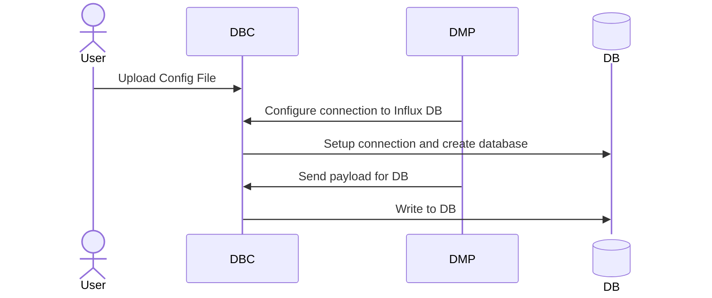
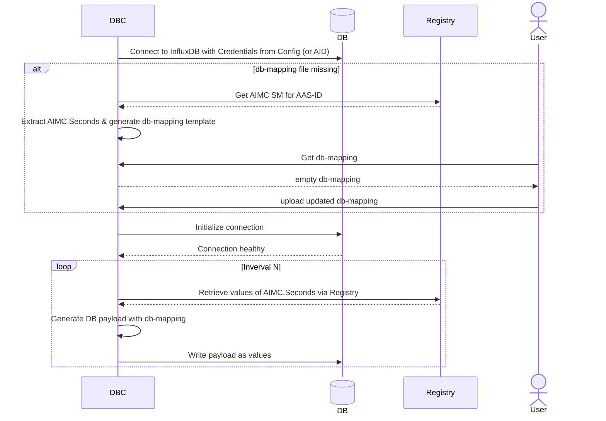
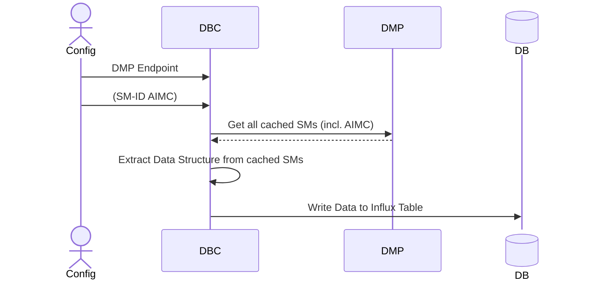
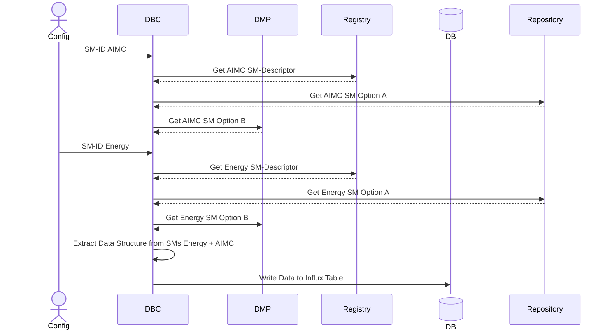

# Interaction of ms-db-connector with other components

## Option 1: Use a ready-to-go configuration file



Example `dbc-configuration.json`:

```json
    {
        "MappingConfigurations[0]": {
                "EnergyConnection_Electric.EnergyMeasure_EnergyTotal.value": "field",
                "EnergyConnection_Electric.EnergyMeasure_EnergyTotal.timeStamp": "timestamp",
                "EnergyConnection_Pneumatic.EnergyMeasure_Pressure.timeStamp": "field",
                "EnergyConnection_Pneumatic.EnergyMeasure_VolumeTotal.timeStamp": "field",
                "EnergyConnection_Pneumatic.EnergyMeasure_VolumeTotal.value": "field",
                "EnergyConnection_Pneumatic.EnergyMeasure_Pressure.value": "field",
                "machineStateData.counter": "tag",
                "machineStateData.pattern": "tag",
                "machineStateData.machineState": "tag"
        }
    }
```

Requirements for the configuration:

- All sink paths from one MappingConfiguration SML are written in one Measurement.
- The entire sink path will be used as Field name.
- `MappingConfigurations[0]` is the default name of the Influx Measurement. This can be changed to another name if wanted.
- Only one of the mapping elements inside a MappingConfiguration can be used for `timestamp`.
- For now, one must decide between the usage as `field` **or** `tag`. Both at once is not possible.
- A default tag named `source` will be used with the value of the idShort of the AAS.

### Local Dev Process



**Prerequisites for process:**

Influx/ Server Configuration `<server name or type>_server_config.json`

```json
{
    "ServerConfiguration": {
        "BaseUrl": "http://localhost:8030/",
        "TimeOut": 60,
        "ConnectionTimeOut": 60,
        "TrustEnv": false,
        "EncodedIds": false,
        "AuthenticationSettings": {
            "BasicAuthentication": {
                "Username": ""
            },
            "ServiceProviderAuthentication": {
                "ClientId": "",
                "TokenUrl": "",
                "GrantType": "client_credentials"
            },
            "BearerAuthentication": {
                "Token": ""
            }
        }
    },
    "SecretVarName": "SECRET_VAR_NAME"
}
```

`SECRET_VAR_NAME` must be set in compose.yml.

Service Configuration `service_config.json`

```json
{
    "AasId": "https://fluid40.de/ids/shell/5793_5449_7830_4223",
    "PollingInterval": 5,
    "ExternalUrl": "http://127.0.0.1",
    "ExternalPort": "3088"
}
```

---
The following sections are deprecated

## Option 1: Configure DBC for direct integration with ms-data-mapping-processor



## Option 2: Configure DBC for usage of Registry


