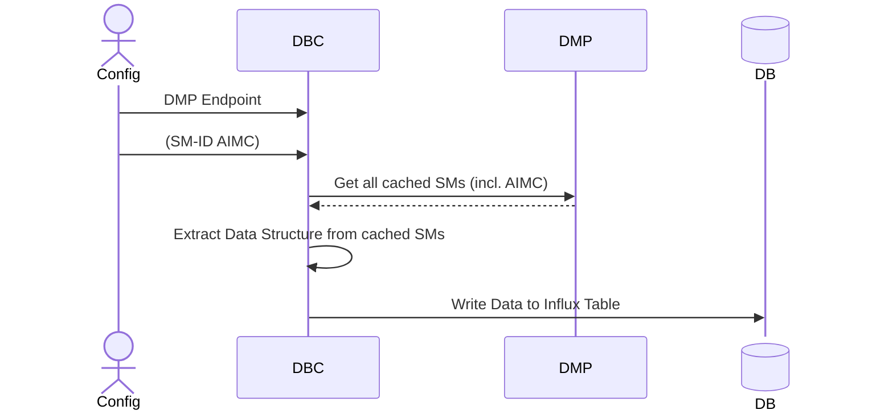
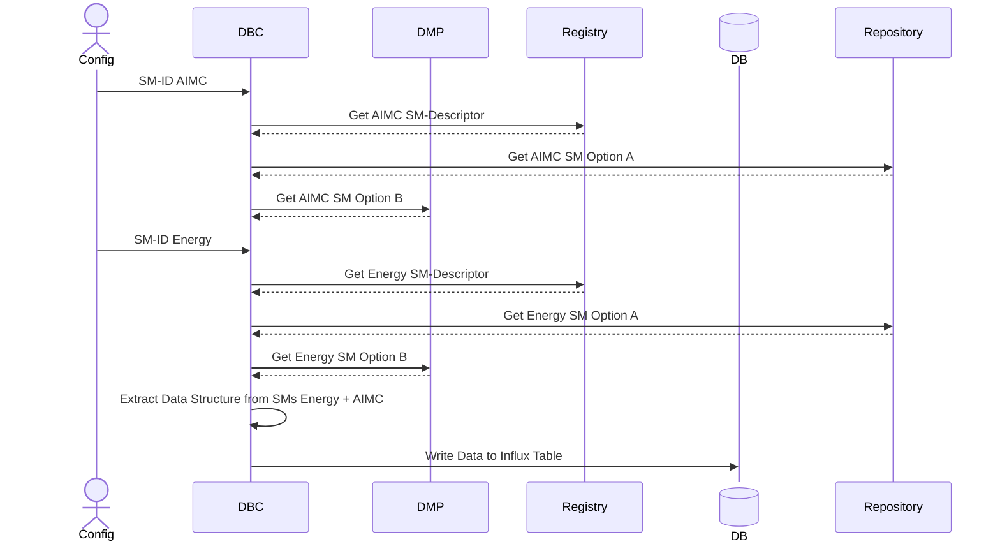

# Interaction of ms-db-connector with other components

## Option 1: Configure DBC for direct integration with ms-data-mapping-processor

```mermaid
sequenceDiagram
    actor Config
    participant DBC
    participant DMP
    participant DB@{ "type" : "database" }
    
    Config->>DBC: DMP Endpoint
    Config->>DBC: (SM-ID AIMC)
    DBC->>DMP: Get all cached SMs (incl. AIMC)
    DMP-->>DBC:
    
    DBC->>DBC: Extract Data Structure from cached SMs

    DBC->>DB: Write Data to Influx Table
    
```

## Option 2: Configure DBC for usage of Registry

```mermaid
sequenceDiagram
    actor Config
    participant DBC
    participant DMP
    participant Registry
    participant DB@{ "type" : "database" }
    

    Config->>DBC: SM-ID AIMC
    DBC->>Registry: Get AIMC SM-Descriptor
    Registry-->>DBC:
    DBC->>Repository: Get AIMC SM Option A
    Repository-->>DBC:
    DBC->>DMP: Get AIMC SM Option B
    DMP-->>DBC:
    
    Config->>DBC: SM-ID Energy
    DBC->>Registry: Get Energy SM-Descriptor
    Registry-->>DBC:
    DBC->>Repository: Get Energy SM Option A
    Repository-->>DBC:
    DBC->>DMP: Get Energy SM Option B
    DMP-->>DBC:

    DBC->>DBC: Extract Data Structure from SMs Energy + AIMC

    DBC->>DB: Write Data to Influx Table
    
```
